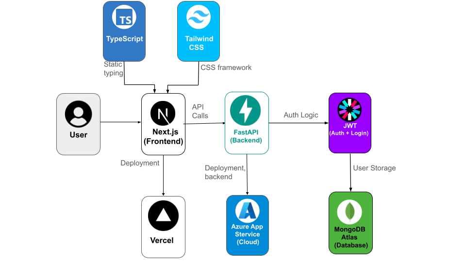

# Cloud Recon - Cloud Security Assessment Platform

A comprehensive cloud security assessment and testing platform built with FastAPI and Next.js. Cloud Recon provides a secure environment for practicing cloud security techniques and cloud infrastructure assessments.

## Architecture

- **Frontend**: Next.js 14 + TypeScript + Tailwind CSS
- **Backend**: FastAPI + Python 3.10+
- **Database**: MongoDB Atlas
- **Authentication**: JWT with bcrypt password hashing
- **Deployment**: 
  - Frontend: Vercel
  - Backend: Azure App Service

## Technology Stack


## Features

- **User Authentication**: Secure JWT-based registration and login
- **Cloud Infrastructure Discovery**: Simulated cloud asset discovery and service enumeration
- **Cloud Security Validation**: API misconfigurations, IAM issues, S3 bucket exposure, serverless injection, and container escape testing
- **Cloud Audit Trail**: Comprehensive logging of all cloud security assessment activities
- **Cloud Threat Intelligence**: Access to cloud-specific vulnerability information and security advisories
- **Cloud Traffic Analysis**: Sample cloud network traffic and API call analysis
- **Cloud Environment Setup Guide**: Instructions for setting up cloud security testing environments

## Project Structure

```
cloud-recon/
├── backend/                  # FastAPI application
│   ├── main.py              # Application entry point
│   ├── db.py                # MongoDB connection
│   ├── models.py            # Pydantic models
│   ├── auth.py              # JWT authentication
│   ├── routes/              # API endpoints
│   └── utils/               # Utility functions
├── frontend/                # Next.js application
│   ├── app/                 # App router pages
│   ├── components/          # React components
│   ├── lib/                 # Utility libraries
│   └── styles/              # CSS styles
├── .env.example             # Environment variables template
└── README.md
```

## Installation & Setup

### Prerequisites

- Python 3.10+
- Node.js 18+
- MongoDB Atlas account
- Azure account (for backend deployment)
- Vercel account (for frontend deployment)

### Backend Setup

1. **Clone the repository**
   ```bash
   git clone <repository-url>
   cd cloud-recon/backend
   ```

2. **Create virtual environment**
   ```bash
   python -m venv venv
   source venv/bin/activate  # On Windows: venv\Scripts\activate
   ```

3. **Install dependencies**
   ```bash
   pip install -r requirements.txt
   ```

4. **Set up environment variables**
   ```bash
   cp .env.example .env
   # Edit .env with your MongoDB URI and JWT secret
   ```

5. **Run the development server**
   ```bash
   uvicorn main:app --reload
   ```

The API will be available at `http://localhost:8000`

### Frontend Setup

1. **Navigate to frontend directory**
   ```bash
   cd ../frontend
   ```

2. **Install dependencies**
   ```bash
   npm install
   ```

3. **Set up environment variables**
   ```bash
   cp .env.example .env.local
   # Edit .env.local with your API URL
   ```

4. **Run the development server**
   ```bash
   npm run dev
   ```

The frontend will be available at `http://localhost:3000`

## Environment Variables

### Backend (.env)
```bash
MONGO_URI=mongodb+srv://<USERNAME>:<PASSWORD>@<CLUSTER>.mongodb.net/cloudrecon?retryWrites=true&w=majority
JWT_SECRET_KEY=your-super-secure-jwt-secret-key
```

### Frontend (.env.local)
```bash
NEXT_PUBLIC_API_URL=http://localhost:8000
```

## Deployment

### Backend (Azure App Service)

1. **Create Azure App Service**
   - Choose Linux + Python 3.10
   - Set startup command: `gunicorn -w 4 -k uvicorn.workers.UvicornWorker main:app`

2. **Configure environment variables in Azure**
   - Add `MONGO_URI` and `JWT_SECRET_KEY` in Configuration settings

3. **Deploy via GitHub Actions or ZIP deployment**

### Frontend (Vercel)

1. **Connect GitHub repository to Vercel**

2. **Set environment variables**
   ```bash
   NEXT_PUBLIC_API_URL=https://your-backend-url.azurewebsites.net
   ```

3. **Deploy automatically via Git push**

## API Documentation

Once the backend is running, visit `http://localhost:8000/docs` for interactive API documentation powered by FastAPI and Swagger UI.

### Key Endpoints

- `POST /api/register` - User registration
- `POST /api/login` - User authentication
- `GET /api/me` - Get current user profile
- `POST /api/discover` - Perform cloud infrastructure discovery
- `POST /api/validate` - Test cloud security configurations
- `GET /api/audit` - Retrieve cloud audit trail
- `GET /api/threats` - Get cloud threat intelligence
- `GET /api/traffic` - Get cloud traffic analysis data
- `GET /api/setup` - Get cloud environment setup guide

## Security Features

- **JWT Authentication**: Secure token-based authentication
- **Password Hashing**: bcrypt for secure password storage
- **CORS Protection**: Configured for production domains
- **Input Validation**: Pydantic models for API validation
- **Rate Limiting**: Built-in protection against abuse

## Testing

### Backend Testing
```bash
cd backend
python -m pytest
```

### Frontend Testing
```bash
cd frontend
npm run test
```

## Usage Examples

### Cloud Infrastructure Discovery
```bash
curl -X POST "http://localhost:8000/api/discover" \
     -H "Authorization: Bearer YOUR_JWT_TOKEN" \
     -H "Content-Type: application/json" \
     -d '{"target": "api.example.com"}'
```

### Cloud Security Validation
```bash
curl -X POST "http://localhost:8000/api/validate" \
     -H "Authorization: Bearer YOUR_JWT_TOKEN" \
     -H "Content-Type: application/json" \
     -d '{
       "test_type": "api_misconfiguration",
       "target_url": "https://api.example.com",
       "payload": "GET /api/v1/users?admin=true"
     }'
```

## Contributing

1. Fork the repository
2. Create a feature branch (`git checkout -b feature/amazing-feature`)
3. Commit your changes (`git commit -m 'Add some amazing feature'`)
4. Push to the branch (`git push origin feature/amazing-feature`)
5. Open a Pull Request

## Legal Disclaimer

This platform is designed for educational purposes and authorized cloud security testing only. Users are responsible for ensuring they have proper authorization before testing any cloud systems. The developers are not responsible for any misuse of this platform.

## License

This project is licensed under the MIT License - see the LICENSE file for details.

## Support

For support, please open an issue on GitHub or contact the development team.

